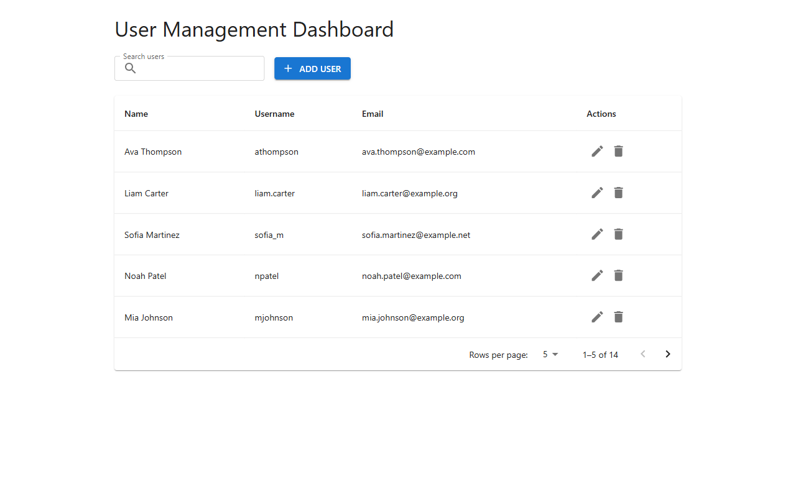
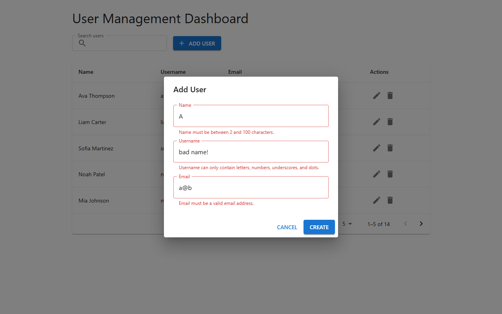
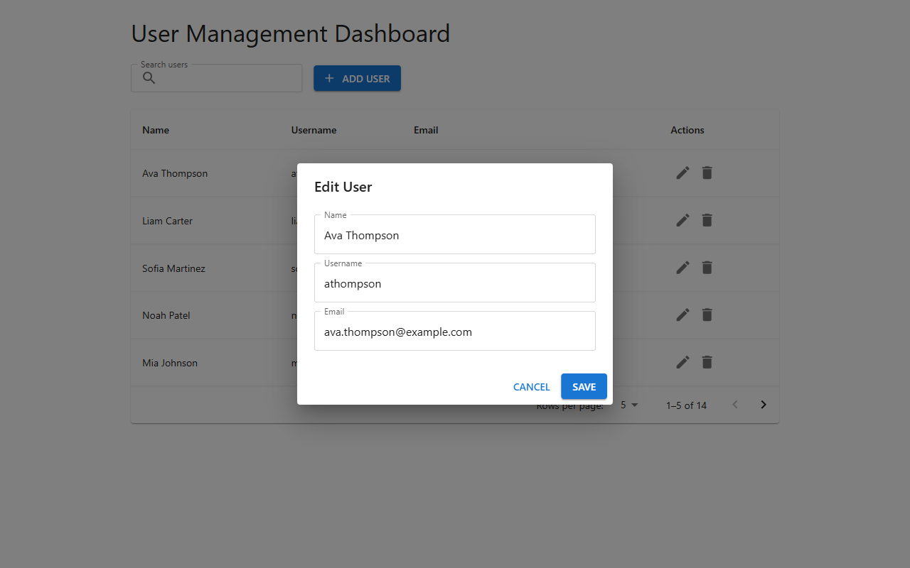
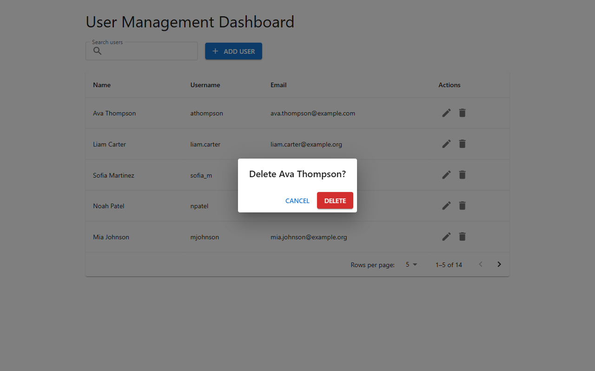
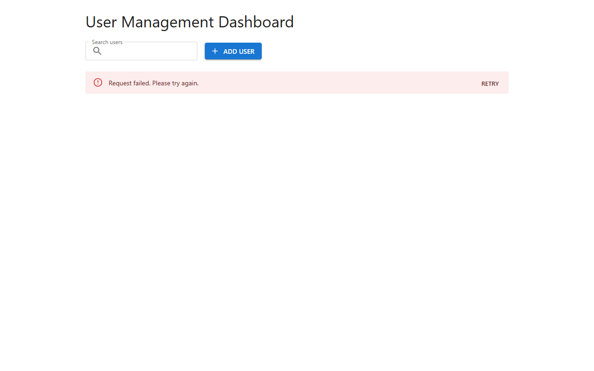

# User Management Dashboard

## Overview

A small full-stack app for managing users. From one dashboard page you can list, search, create, edit, and delete users.

- The backend is an Express REST API that stores the users in a JSON file, `backend/data/user.json`, which ships with 14 seed users.
- The frontend is a React + MUI dashboard with a case-insensitive search across name, username, and email, client-side pagination (5, 10, or 25 rows per page), a form dialog with validation, a confirmation step before deleting, and a snackbar message after each change.

## Screenshots



*User list: the first page of the 14 seed users, 5 rows per page.*


*Search: "son" matches Ava Thompson and Mia Johnson.*


*Empty state: a search without matches shows "No users found".*



*Create dialog: invalid input shows a message under each field, and no request is sent.*



*Edit dialog: the same form, prefilled with the selected user.*



*Delete confirmation: a user is deleted only after confirming.*



*Error state: when the list cannot be loaded, the error message and a Retry button replace the table.*

## Tech Stack

Both apps are plain JavaScript with ES modules.

- **Backend:** Node.js, Express 5, cors 2, and dotenv 18, tested with Vitest 5 and Supertest 7.
- **Frontend:** React 19, Vite 8, MUI (Material UI) 9 with MUI icons, Emotion 11 as MUI's styling engine, and ESLint 10.

## Prerequisites

- Node.js 22.12+ or 24+ (LTS)
- npm (included with Node.js)
- Git

## Running the Backend

From the repository root:

```
cd backend
npm install
npm run dev
```

`npm run dev` restarts the server when a source file changes. To run it without watching:

```
npm start
```

The API runs at http://localhost:4000.

No configuration is needed. A `backend/.env` file, copied from `backend/.env.example`, is needed only to change these defaults:

| Variable | Purpose | Default |
|---|---|---|
| `PORT` | Port the API listens on | `4000` |
| `DATA_FILE` | JSON file that stores the users; a relative path is resolved against `backend/` | `./data/user.json` |
| `CORS_ORIGIN` | Origin allowed to call the API from a browser | `http://localhost:5173` |

Variables already set in the environment take precedence over `backend/.env`. The frontend's dev proxy targets port 4000, so if you change `PORT`, update the proxy in `frontend/vite.config.js` too.

## Running the Frontend

Start the backend first. Then, in a second terminal, from the repository root:

```
cd frontend
npm install
npm run dev
```

Open http://localhost:5173. The Vite dev server proxies every `/api` request to the backend at http://localhost:4000, so the browser only talks to one origin.

## Running the Tests

The backend tests use Vitest and Supertest:

```
cd backend
npm test
```

They cover every endpoint and error status, the validation rules, the service, the JSON repository, the seed data, and concurrent requests. Tests that touch storage work on temporary data files, mostly copies of the seed, so `backend/data/user.json` is never changed.

The frontend has no automated tests. To lint it with ESLint:

```
cd frontend
npm run lint
```

## API Endpoints

The base URL is http://localhost:4000, and request and response bodies are JSON.

| Method | Path | Success | Errors |
|---|---|---|---|
| GET | `/api/users` | 200 | 500 |
| GET | `/api/users/:id` | 200 | 400, 404, 500 |
| POST | `/api/users` | 201 | 400, 409, 500 |
| PUT | `/api/users/:id` | 200 | 400, 404, 409, 500 |
| DELETE | `/api/users/:id` | 204 | 400, 404, 500 |

### Rules

- `name`: required, 2–100 characters.
- `username`: required, 3–30 characters, using only letters, numbers, `_`, or `.`.
- `email`: required, in a valid email format.
- `username` and `email` must be unique, ignoring letter case.
- Values are trimmed before they are checked and stored. An `id` or any other extra field in the body is ignored, and the server assigns each new user the highest id + 1.
- `PUT` is a full update, so all three fields are required.
- `:id` must be a positive integer.

### List users

```http
GET /api/users
```

```http
HTTP/1.1 200 OK

[
  {
    "id": 1,
    "name": "Ava Thompson",
    "username": "athompson",
    "email": "ava.thompson@example.com"
  },
  {
    "id": 2,
    "name": "Liam Carter",
    "username": "liam.carter",
    "email": "liam.carter@example.org"
  }
]
```

The response lists every user in stored order. It is shortened here to the first two of the 14 seed users.

### Get a user

```http
GET /api/users/7
```

```http
HTTP/1.1 200 OK

{
  "id": 7,
  "name": "Isabella Rossi",
  "username": "bella.rossi",
  "email": "isabella.rossi@example.net"
}
```

### Create a user

```http
POST /api/users
Content-Type: application/json

{
  "name": "Grace Lee",
  "username": "grace.lee",
  "email": "grace.lee@example.com"
}
```

```http
HTTP/1.1 201 Created

{
  "id": 15,
  "name": "Grace Lee",
  "username": "grace.lee",
  "email": "grace.lee@example.com"
}
```

### Update a user

```http
PUT /api/users/7
Content-Type: application/json

{
  "name": "Isabella Rossi",
  "username": "bella.rossi",
  "email": "bella.rossi@example.com"
}
```

```http
HTTP/1.1 200 OK

{
  "id": 7,
  "name": "Isabella Rossi",
  "username": "bella.rossi",
  "email": "bella.rossi@example.com"
}
```

### Delete a user

```http
DELETE /api/users/7
```

```http
HTTP/1.1 204 No Content
```

### Errors

Every error response has the shape `{ "error": { "message": ..., "fields"?: ... } }`. That includes the 404 for unknown routes and the 400 for malformed JSON bodies. `fields` appears only on validation (400) and duplicate (409) errors, and maps each failing field to its message:

```http
POST /api/users
Content-Type: application/json

{
  "name": "A",
  "username": "bad name!",
  "email": "a@b"
}
```

```http
HTTP/1.1 400 Bad Request

{
  "error": {
    "message": "Validation failed.",
    "fields": {
      "name": "Name must be between 2 and 100 characters.",
      "username": "Username can only contain letters, numbers, underscores, and dots.",
      "email": "Email must be a valid email address."
    }
  }
}
```

| Status | Message | When |
|---|---|---|
| 400 | `Validation failed.` | Invalid `name`, `username`, or `email`, with `fields` |
| 400 | `User id must be a positive integer.` | The `:id` is not a positive integer |
| 400 | `Request body is not valid JSON.` | The body is malformed JSON |
| 404 | `User not found.` | No user has that id |
| 404 | `Route not found.` | Unknown route or unsupported method |
| 409 | `Username or email is already in use.` | Another user has the username or email, with `fields` |
| 500 | `User data file is corrupt.` | The data file does not hold a JSON array |
| 500 | `Internal server error.` | Any other failure; the details are only logged on the server |

## Folder Structure

```
.
├── backend/
│   ├── data/                         # the seed users, also the default data file
│   │   └── user.json
│   ├── src/
│   │   ├── controllers/              # turn requests into service calls and pick the success status
│   │   │   └── userController.js
│   │   ├── errors/                   # AppError and its 400, 404, 409, and 500 subclasses
│   │   │   └── appErrors.js
│   │   ├── middleware/               # 404 for unknown routes and the single error handler
│   │   │   ├── errorHandler.js
│   │   │   └── notFound.js
│   │   ├── repositories/             # JSON file storage with the write queue
│   │   │   └── jsonUserRepository.js
│   │   ├── routes/                   # the /api/users routes and their validation middleware
│   │   │   └── userRoutes.js
│   │   ├── services/                 # business rules: ids, uniqueness, not found
│   │   │   └── userService.js
│   │   ├── validation/               # id and user input validation
│   │   │   └── userValidation.js
│   │   ├── app.js                    # createApp factory, used by the server and the tests
│   │   ├── config.js                 # PORT, DATA_FILE, and CORS_ORIGIN with their defaults
│   │   └── server.js                 # entry point: builds the app and listens
│   ├── tests/                        # Vitest and Supertest suites
│   │   ├── helpers/                  # temp data files, app builder, error assertions
│   │   │   └── testUtils.js
│   │   ├── app.test.js
│   │   ├── concurrency.test.js
│   │   ├── createUser.test.js
│   │   ├── deleteUser.test.js
│   │   ├── getUsers.test.js
│   │   ├── jsonUserRepository.test.js
│   │   ├── seedData.test.js
│   │   ├── updateUser.test.js
│   │   ├── userService.test.js
│   │   └── userValidation.test.js
│   ├── .env.example
│   └── package.json
├── docs/
│   └── screenshots/                  # the screenshots shown above
├── frontend/
│   ├── src/
│   │   ├── api/                      # fetch wrapper for the users API and ApiError
│   │   │   └── usersApi.js
│   │   ├── components/               # the table, search bar, and dialogs
│   │   │   ├── ConfirmDeleteDialog.jsx
│   │   │   ├── SearchBar.jsx
│   │   │   ├── UserFormDialog.jsx
│   │   │   └── UserTable.jsx
│   │   ├── hooks/                    # the user list state and the debounced search value
│   │   │   ├── useDebouncedValue.js
│   │   │   └── useUsers.js
│   │   ├── utils/                    # the client-side copy of the API's validation rules
│   │   │   └── validation.js
│   │   ├── App.jsx                   # page layout, search, pagination, dialogs, and snackbar
│   │   ├── main.jsx                  # React entry point with the MUI theme
│   │   └── theme.js                  # MUI theme with the system font stack
│   ├── eslint.config.js
│   ├── index.html
│   ├── package.json
│   └── vite.config.js                # dev server on port 5173, proxies /api to port 4000
├── .gitignore
└── README.md
```

## Design Decisions and Trade-offs

- **JSON file storage.** Why: there is no database to install or configure, and the data is a readable file that doubles as the seed. Limitation: every change rewrites the whole file, and the approach does not suit large datasets or several server processes sharing one file.
- **The write queue.** Why: the repository runs every read and every read-modify-write through one promise chain, one at a time, so concurrent requests cannot lose updates or create duplicate ids, usernames, or emails. Limitation: the queue lives in memory, so it only works within one Node.js process, and it handles one request's storage work at a time.
- **Validation in both the frontend and the backend.** Why: the dialog shows messages instantly, without a request, while the API stays the authority and checks every request, including uniqueness. Limitation: the two copies, `backend/src/validation/userValidation.js` and `frontend/src/utils/validation.js`, must be kept in sync by hand.
- **Client-side search and pagination for a small dataset.** Why: the dashboard loads the list once and filters and pages it in the browser, so both are instant and send no extra requests. The search waits for a 300 ms pause in typing. Limitation: the whole list is loaded at once, which won't scale to large datasets.
- **Atomic saves.** Each save writes `user.json.tmp` and renames it over the data file, so the file always holds a complete array. A corrupt data file is reported as a 500 and never overwritten.
- **Layered backend with an app factory.** Requests go from routes through validation middleware, controllers, and services to the repository, and one error handler sends every error response. `createApp` builds the app without listening on a port, so the tests drive it with Supertest against their own data file.
- **No in-memory cache.** Every request reads the file, so the file is the single source of truth and edits to it show up on the next request, at the cost of one file read per request.

## Possible Improvements

- Authentication and authorization. The API is intentionally unauthenticated for this local demo, so anyone who can reach it can change the data.
- A real database, such as SQLite or PostgreSQL, instead of the JSON file.
- Server-side search, pagination, and sorting for larger datasets.
- Automated frontend tests, both component and end-to-end.
- TypeScript in the backend and the frontend.
